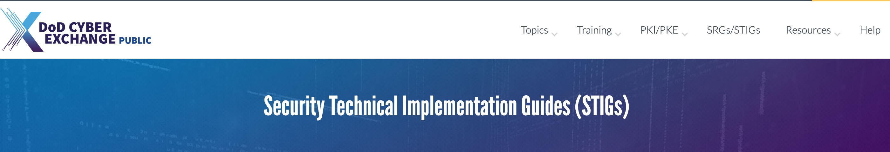
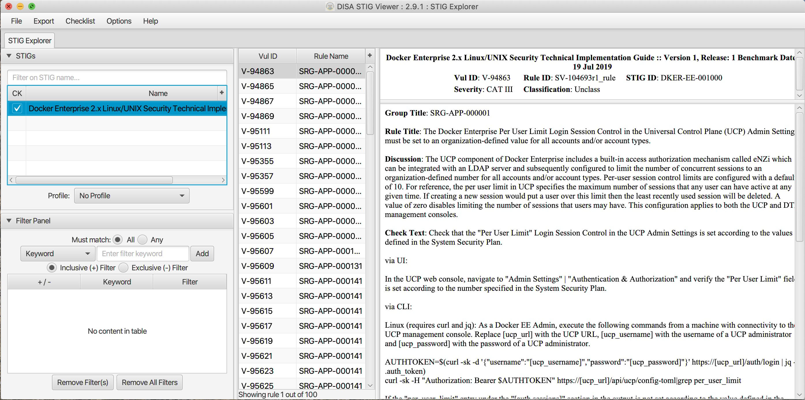

# Docker Enterprise - The first DISA STIG'ed container platform!

Docker Enterprise was built with the one idea in mind, Secure by Default. When building a Secure By Default platform one needs to consider security validation and Governmental use. Thanks to [Defense Information Systems Agency ( DISA )](https://public.cyber.mil/) for allowing Docker to become the first Docker Container platform with a Security Technical Implementation Guides ( STIG ). Having a STIG allows Agencies to ensure they are running Docker Enterprise is the most secure manor. The STIG also provides validation for not only the public sector but also to the private sector. One of the great concepts with any compliance framework, like STIGs, is the idea of inherited controls. Meaning adopting a STIG recommendation helps in improving the security posture. Here is a great blurb from [DISA' site](https://public.cyber.mil/stigs/):

*The Security Technical Implementation Guides (STIGs) are the configuration standards for DOD IA and IA-enabled devices/systems. Since 1998, DISA has played a critical role enhancing the security posture of DoD’s security systems by providing the Security Technical Implementation Guides (STIGs). The STIGs contain technical guidance to “lock down” information systems/software that might otherwise be vulnerable to a malicious computer attack.*

[GCN](https://gcn.com/articles/2015/05/14/disa-stig-compliance.aspx) has a good point about using the STIG as a security baseline.

*If you look at any best practice guidance, regulation or standards around effective IT security out on the market today, you will see that it advises organizations to ensure their computing systems are configured as securely as possible and monitored for changes.*

*To many, the Security Technical Implementation Guides from the Defense Information Systems Agency  represent a questionable exercise in compliance.  Yet the STIGs play a real and important role in helping prevent cyber attacks for both the federal government and commercial organizations.*

So now you are curious to see what is in the STIG. STIGs are formatted in xml and require viewing through the STIG viewer. The STIG viewer is a custom GUI written in Java. DISA has a page dedicated to [STIG Viewing](https://public.cyber.mil/stigs/srg-stig-tools/) tools. Specifically you can find the latest [DISA STIG Viewer](https://public.cyber.mil/stigs/srg-stig-tools/) here.

The STIG can currently be found in the [August 8th STIG Compliation](https://public.cyber.mil/stigs/compilations/). Once unzipped navigate to **OS-VRT- Docker Enterprise 2.x STIG** and locate **U_Docker_Enterprise_2-x_Linux-UNIX_V1R1_STIG.zip**. Contained in final zip file is all the documentation and xml STIG itself. Here are quick links to the STIG.

Please keep in mind that the current STIG calls out Docker Enterprise 2.x. The STIG absolutely applies to Docker Enterprise 3.X!

Lets dig into the STIG itself. There is some good information about the STIG and DISA's authority from [Overview pdf](./U_Docker_Enterprise_2-x_Linux-UNIX_V1R1_Overview.pdf).

*1.1 Executive Summary*
*This Docker Enterprise 2.x Linux/UNIX Security Technical Implementation Guide (STIG) provides the technical security policies, requirements, and implementation details for applying security concepts to container platforms that are built using the Docker Enterprise product suite, specifically for Linux and UNIX, which is built and maintained by Docker, Inc. It also incorporates high-level technical guidance for establishing a secure software supply chain, using the Docker Enterprise platform in concert with containers based on a standard image format and runtime prevalent in industry. The Docker platform is designed to give both developers and IT professionals the freedom to build, manage, and secure mission-critical applications with no technology or infrastructure lock-in. Docker enables a secure, trusted software supply chain workflow which is used as the foundation for building software and for deploying applications onto any infrastructure; from traditional on-premises datacenters, to public cloud providers.*

From the STIG itself there are only 100 controls. Here is the breakdown.

| Category | Controls |
|:--------:|:--------:|
| CAT 1    | 23       |
| CAT 2    | 72       |
| CAT 3    | 5        |
| Total    | 100      |

For reference CAT 1 is the most important controls to pay attention to. As you can see there are only 23 CAT 1. AND the bulk of those controls are "what not to do" controls. Meaning they are checks to ensure a situation is not occurring. With only 100 total controls there is not a lot of work to do to harden Docker Enterprise.

If you are interested in learning more why Docker Enterprise is Secure by Default please take a look at our [Security Reference Architecture](https://success.docker.com/article/security-best-practices).

We also have good information on our [Government page](https://www.docker.com/solutions/government).

Or if you are ready to start a proof of concept please [contact sales](https://www.docker.com/company/contact-sales).
